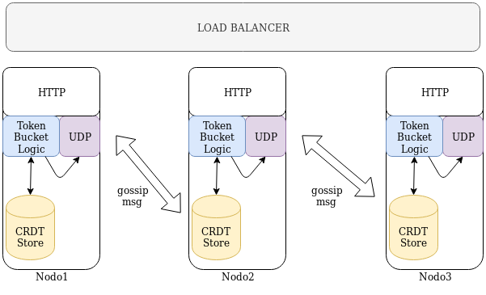

# Simple and Quick Python

Prototype to test token bucket, gossip and CRDT for a distributed rate limiter

## How to run

Each .sh file is one node listening on localhost:8000, :8001, :8002

This files are wrappers of `http_srv.py` 

## Schema

